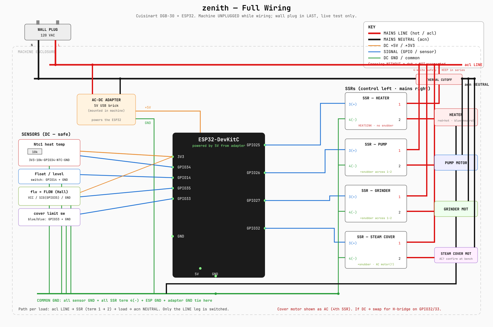

# zenith

Full ESP32 takeover of a **Cuisinart DGB-30** single-cup grind-and-brew coffee
maker. Goal: direct control over every brew variable avalaible — brew temp, pump dose/flow,
grinder dose. The original factory control board has been removed entirely —
an ESP32takes over

---

## Architecture

Two tiers:

- **ESP32** — real-time controller. Drives the loads (heater,
  pump, grinder, motorized steam cover) through solid-state relays, reads the
  sensors, runs the safety loops (dry-pump guard, command watchdog). Must run
  safe standalone.
- **Pi / phone** — high-level brain over WiFi/HTTP/MQTT. Sits on top.
  The ESP never depends on it. // TODO

The factory control board is gone The ESP32 replaces it wholesale: SSRs replace the 
factory relays, an in-machine
AC-DC adapter replaces the board's power supply, and mains is redistributed on a
barrier strip. // Any thermal cutoff stays inline in the mains safety path.

**Roadmap:** a Raspberry Pi is the  second tier on top of the ESP32 —
for logging, brew profiles, and **real-time streamed control** (live telemetry
out, time-varying setpoint/profile stream in). The ESP32 always holds the
real-time loop and fails safe if the stream drops. Full design in
[`docs/architecture.md`](docs/architecture.md).

---

## Files

| File | Purpose |
|------|---------|
| `findings.md` | Master findings — loads, sensors (with confidence tags), board decode |
| `wiring.md` | Full wiring guide: sensors to ESP, SSRs to mains, build order |
| `wiring.svg` / `wiring.png` | Visual wiring diagram |
| `docs/architecture.md` | Two-tier roadmap: Pi-on-top + real-time streamed control |

Firmware (PlatformIO `platformio.ini` + `src/main.cpp`) is planned but not yet
committed here.

---

## Loads (the 4 knobs)

| Load | ESP pin | Control |
|------|---------|---------|
| Heater | GPIO25 | SSR-40DA, slow-PWM for temp |
| Pump motor | GPIO26 | SSR-40DA + RC snubber |
| Grinder motor | GPIO27 | SSR-40DA + RC snubber |
| Steam cover motor | GPIO32 (+GPIO33 limit in) | SSR if AC / H-bridge if DC — TBD at bench |

Mains: **acl / acn** = Line / Neutral. Each SSR sits in series with the Line leg
of its load; Neutral runs straight through.

## Sensors

| Sensor | ESP pin | Type |
|--------|---------|------|
| Heatblock temp (`Ntc1`) | GPIO34 | NTC thermistor, 10k divider |
| Water level / float | GPIO14 | switch, INPUT_PULLUP |
| Flow (`flu`) | GPIO35 | Hall pulse — enables volumetric dosing |
| Green-tab (TBD) | GPIO39 | thermistor / switch / cutoff — unconfirmed |

Only **temp + float** are must-haves for control. Flow is the bonus that enables
dosing by volume even without a triac (fixed pump speed, measured flow).

---

## Status

Bench findings documented; parts on hand (3× SSR-40DA, ESP32-DevKitC-32E,
resistors, RC snubbers). Wiring guide written. Live testing and firmware
calibration pending — see the open-items lists in `findings.md` and `wiring.md`.

## Diagram

